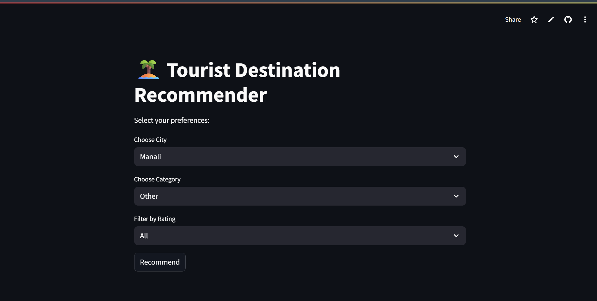
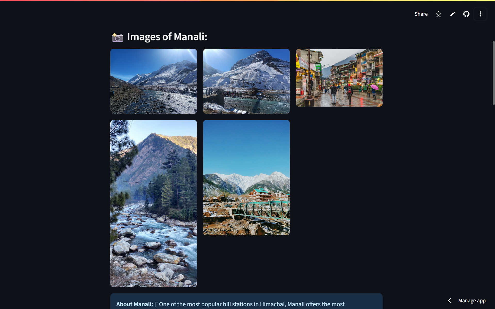
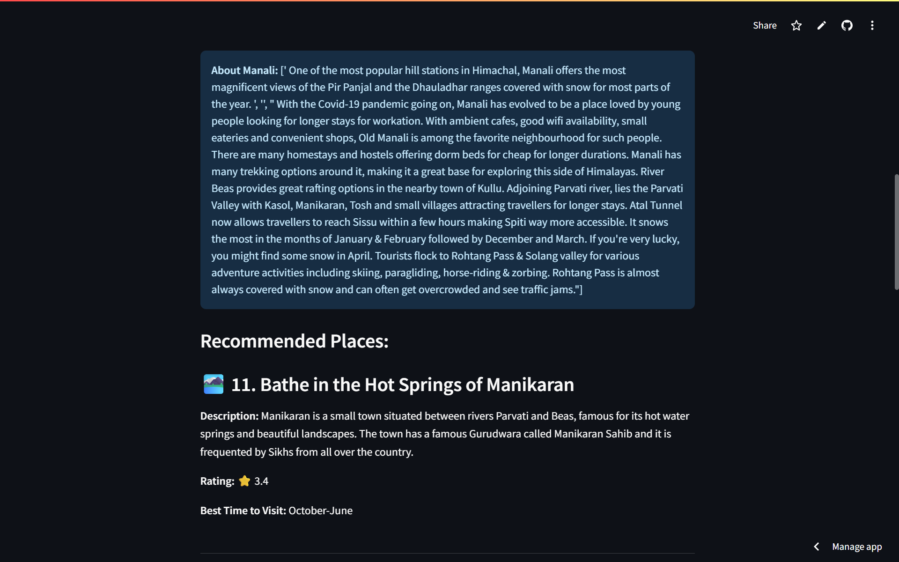
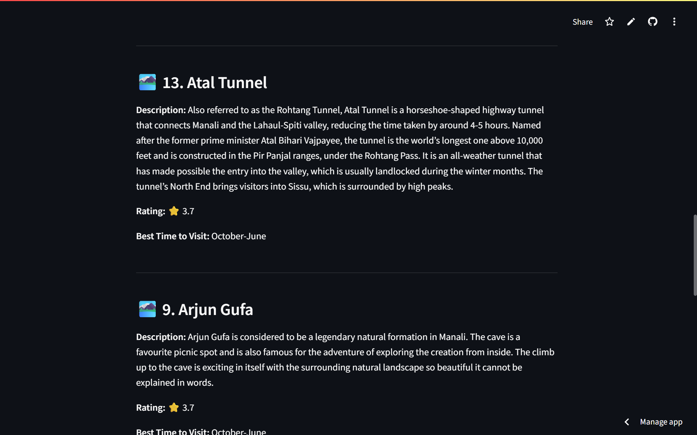

#  🧭 Tourist Destinations Recommendation App

🌍 **Discover travel destinations** personalized just for you using a smart recommendation system. Just select a city and category, and get personalized suggestions in seconds!

🔗 **Live Demo**: [tourist-destinations-recommendation.streamlit.app](https://tourist-destinations-recommendation.streamlit.app/)

## ✨ Features

- 🔍 **Search by City and Category**
- ⭐ **Recommendations based on ratings and features**
- 📈 Powered by **K-Nearest Neighbors (KNN)** algorithm
- 🖼️ Clean and interactive **Streamlit** interface
- 📊 Dataset-driven, with filtering and sorting options

## 📸 Screenshots

**🔽 Input Selection**

## 📸 Recommendation Output

| Output Image 1 | Output Image 2 | Output Image 3 |
| -------------- | -------------- | -------------- |
|  |  |  |

## 🛠️ Tech Stack

- **Python 3.11** — main programming language
- **Streamlit** — for building the interactive web app interface
- **scikit-learn** — machine learning (KNN algorithm)
- **pandas** — data manipulation and analysis
- **Git & GitHub** — version control and repository hosting

## 🤝 How to Contribute

Contributions are always welcome! If you want to help improve this project, please follow these steps:

1. Fork the repository  
2. Create a new branch (`git checkout -b feature/YourFeature`)  
3. Make your changes and commit (`git commit -m 'Add some feature'`)  
4. Push to the branch (`git push origin feature/YourFeature`)  
5. Open a Pull Request here on GitHub  

Please make sure your code follows the existing style and includes comments where necessary.  
Feel free to open issues for any bugs or feature requests!

